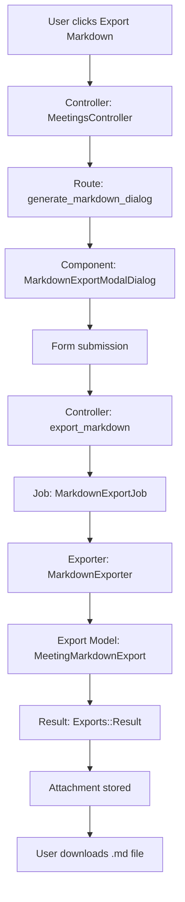

# Test-Driven Development Plan: Meeting Markdown Export Plugin

## Overview

This document outlines a test-driven development (TDD) approach to create a plugin that adds a "Export Markdown" menu item under the existing "Export PDF" option in the Meetings module.

## Architecture Diagram



## Plugin Structure

```
modules/meeting_markdown_export/
├── app/
│   ├── components/
│   │   └── meetings/
│   │       └── exports/
│   │           ├── markdown_modal_dialog_component.html.erb
│   │           └── markdown_modal_dialog_component.rb
│   ├── controllers/
│   │   └── meetings_controller_decorator.rb
│   ├── models/
│   │   └── meeting_markdown_export.rb
│   └── workers/
│       └── meetings/
│           ├── markdown_export_job.rb
│           └── markdown_exporter.rb
├── config/
│   ├── routes.rb
│   └── locales/
│       └── en.yml
├── spec/
│   ├── features/
│   │   └── structured_meetings/
│   │       └── markdown_export_spec.rb
│   ├── workers/
│   │   └── meetings/
│   │       └── markdown_export_job_spec.rb
│   └── support/
│       └── pages/
│           └── meetings/
│               └── show.rb (extend)
├── lib/
│   └── open_project/
│       └── meeting_markdown_export/
│           ├── engine.rb
│           └── version.rb
└── openproject-meeting-markdown-export.gemspec
```

## TDD Implementation Plan

### Phase 1: Foundation Tests (Unit Tests)

#### 1.1 Export Model Test
**File:** `spec/models/meeting_markdown_export_spec.rb`

```ruby
require "spec_helper"

RSpec.describe MeetingMarkdownExport do
  let(:export) { MeetingMarkdownExport.create }

  describe "#ready?" do
    it "returns true when attachments exist" do
      export.attachments << create(:attachment)
      expect(export).to be_ready
    end

    it "returns false when no attachments exist" do
      expect(export).not_to be_ready
    end
  end
end
```

**Implementation:** Create `app/models/meeting_markdown_export.rb`

#### 1.2 Exporter Test
**File:** `spec/workers/meetings/markdown_exporter_spec.rb`

```ruby
require "spec_helper"

RSpec.describe Meetings::MarkdownExporter do
  let(:user) { build_stubbed(:user) }
  let(:project) { create(:project, enabled_module_names: %w[meetings]) }
  let(:meeting) do
    create :meeting,
           project:,
           start_time: "2024-12-31T13:30:00Z",
           duration: 1.5,
           title: "Test Meeting",
           location: "Room 101",
           author: user
  end

  before do
    mock_permissions_for(user, &:allow_everything)
  end

  describe "#export!" do
    it "generates markdown content successfully" do
      exporter = described_class.new(meeting, current_user: user)
      result = exporter.export!

      expect(result).to be_a(Exports::Result)
      expect(result.format).to eq(:markdown)
      expect(result.mime_type).to eq("text/markdown")
      expect(result.title).to end_with(".md")
      expect(result.content).to be_a(StringIO)
    end

    it "includes meeting title in markdown" do
      exporter = described_class.new(meeting, current_user: user)
      result = exporter.export!

      expect(result.content.string).to include("# Test Meeting")
    end

    it "includes project name in markdown" do
      exporter = described_class.new(meeting, current_user: user)
      result = exporter.export!

      expect(result.content.string).to include("**Project:** #{project.name}")
    end

    it "includes date and time in markdown" do
      exporter = described_class.new(meeting, current_user: user)
      result = exporter.export!

      expect(result.content.string).to match(/\*\*Date:\*\* 2024-12-31/)
      expect(result.content.string).to match(/\*\*Time:\*\* 13:30/)
    end

    it "includes location in markdown" do
      exporter = described_class.new(meeting, current_user: user)
      result = exporter.export!

      expect(result.content.string).to include("**Location:** Room 101")
    end

    context "with participants" do
      before do
        create(:meeting_participant, meeting:, user:)
      end

      it "includes participants section when option is enabled" do
        exporter = described_class.new(meeting, current_user: user, participants: true)
        result = exporter.export!

        expect(result.content.string).to include("## Participants")
      end

      it "excludes participants section when option is disabled" do
        exporter = described_class.new(meeting, current_user: user, participants: false)
        result = exporter.export!

        expect(result.content.string).not_to include("## Participants")
      end
    end

    context "with agenda items" do
      before do
        create(:meeting_agenda_item, meeting:, title: "Agenda Item 1")
      end

      it "includes agenda section" do
        exporter = described_class.new(meeting, current_user: user)
        result = exporter.export!

        expect(result.content.string).to include("## Agenda")
        expect(result.content.string).to include("### Agenda Item 1")
      end
    end

    context "with outcomes" do
      before do
        agenda_item = create(:meeting_agenda_item, meeting:)
        create(:meeting_outcome, agenda_item:, notes: "Outcome notes")
      end

      it "includes outcomes when option is enabled" do
        exporter = described_class.new(meeting, current_user: user, outcomes: true)
        result = exporter.export!

        expect(result.content.string).to include("Outcome notes")
      end

      it "excludes outcomes when option is disabled" do
        exporter = described_class.new(meeting, current_user: user, outcomes: false)
        result = exporter.export!

        expect(result.content.string).not_to include("Outcome notes")
      end
    end
  end
end
```

**Implementation:** Create `app/workers/meetings/markdown_exporter.rb`

#### 1.3 Export Job Test
**File:** `spec/workers/meetings/markdown_export_job_spec.rb`

```ruby
require "spec_helper"

RSpec.describe Meetings::MarkdownExportJob do
  let(:user) { build_stubbed(:user) }
  let(:project) { create(:project, enabled_module_names: %w[meetings]) }
  let(:meeting) do
    create :meeting,
           project:,
           start_time: "2024-12-31T13:30:00Z",
           duration: 1.5,
           author: user
  end

  before do
    mock_permissions_for(user, &:allow_everything)
  end

  def perform_meeting_export
    job = described_class.new(
      export: MeetingMarkdownExport.create,
      user: user,
      mime_type: :markdown,
      query: meeting,
      options: {}
    )
    job.perform_now
    job
  end

  RSpec::Matchers.define :have_one_attachment_with_content_type do |expected_content_type|
    def attachments(export_job)
      export_job.status_reference.attachments
    end

    match do |export_job|
      attachments_content_types = attachments(export_job).pluck(:content_type)
      attachments_content_types == [expected_content_type]
    end

    failure_message do |export_job|
      attachments_content_types = attachments(export_job).pluck(:content_type)
      "expected that #{actual} would have one attachment with mime type #{expected.inspect}, " \
        "got #{attachments_content_types.inspect} instead"
    end
  end

  it "generates a markdown export successfully" do
    job = perform_meeting_export

    expect(job.job_status).to be_success, job.job_status.message
    expect(job).to have_one_attachment_with_content_type("text/markdown")
  end

  it "creates an export with correct filename" do
    job = perform_meeting_export
    attachment = job.status_reference.attachments.first

    expect(attachment.filename.to_s).to end_with(".md")
  end
end
```

**Implementation:** Create `app/workers/meetings/markdown_export_job.rb`

### Phase 2: Integration Tests

#### 2.1 Export Registration Test
**File:** `spec/lib/open_project/meeting_markdown_export/engine_spec.rb`

```ruby
require "spec_helper"

RSpec.describe OpenProject::MeetingMarkdownExport::Engine do
  it "registers the markdown exporter for Meeting model" do
    exporter = Exports::Register.single_exporter(::Meeting, :markdown)
    expect(exporter).to eq(Meetings::MarkdownExporter)
  end

  it "includes markdown in available export formats" do
    formats = Exports::Register.single_formats(::Meeting)
    expect(formats).to include(:markdown)
  end
end
```

**Implementation:** Update `lib/open_project/meeting_markdown_export/engine.rb`

#### 2.2 Controller Test
**File:** `spec/requests/meetings_markdown_export_spec.rb`

```ruby
require "spec_helper"

RSpec.describe "Meetings Markdown Export", type: :request do
  let(:user) { create(:user) }
  let(:project) { create(:project, enabled_module_names: %w[meetings]) }
  let(:meeting) do
    create(:meeting, project:, author: user)
  end

  before do
    project.add_member!(user, role: create(:role, permissions: %i[view_meetings]))
    login_as user
  end

  describe "GET #generate_markdown_dialog" do
    it "returns success" do
      get generate_markdown_dialog_project_meeting_path(project, meeting)
      expect(response).to have_http_status(:ok)
    end

    it "renders the markdown export modal dialog component" do
      get generate_markdown_dialog_project_meeting_path(project, meeting)
      expect(response.body).to include("Export Markdown")
    end
  end

  describe "GET #export_markdown (markdown format)" do
    it "creates a markdown export job" do
      expect(Meetings::MarkdownExportJob).to receive(:perform_later).and_call_original

      get project_meeting_path(project, meeting, format: :markdown)

      expect(response).to redirect_to(job_status_path(MeetingMarkdownExport.last.job_status.job_id))
    end

    it "passes correct options to the job" do
      expect(Meetings::MarkdownExportJob).to receive(:perform_later)
        .with(hash_including(options: hash_including(participants: "1", outcomes: "0")))
        .and_call_original

      get project_meeting_path(project, meeting, format: :markdown, participants: "1", outcomes: "0")
    end
  end
end
```

**Implementation:** Create `app/controllers/meetings_controller_decorator.rb`

### Phase 3: Feature Tests (End-to-End)

#### 3.1 UI Test
**File:** `spec/features/structured_meetings/markdown_export_spec.rb`

```ruby
require "spec_helper"

require_relative "../../support/pages/meetings/show"

RSpec.describe "Meetings Export Markdown",
               :js, :selenium do
  shared_let(:project) { create(:project, enabled_module_names: %w[meetings]) }
  shared_let(:meeting) { create(:meeting, project:) }
  shared_let(:user) do
    create(:user,
           lastname: "First",
           member_with_permissions: { project => %i[view_meetings create_meetings edit_meetings delete_meetings manage_agendas
                                                   view_work_packages] }).tap do |u|
      u.pref[:time_zone] = "Etc/UTC"
      u.save!
    end
  end
  let(:show_page) { Pages::Meetings::Show.new(meeting) }
  let(:exporter) { instance_double(Meetings::MarkdownExportJob) }
  let(:default_expected_params) do
    {
      participants: "1",
      outcomes: "0"
    }
  end
  let(:expected_params) do
    default_expected_params
  end

  RSpec::Matchers.define :has_mandatory_options do |expected|
    match do |actual|
      options = actual[:options] || {}
      expected.count do |key, value|
        options[key.to_sym] == value
      end == expected.size
    end
  end

  def generate!
    click_link_or_button "Download"
    sleep 0.5 # quick fix: allow browser to process action
    retry_block do
      expect(page).to have_no_button("Download", wait: 3)
      show_page.expect_modal "Background job status", wait: 3
    end
  end

  def mock_generating_markdown
    allow(Meetings::MarkdownExportJob)
      .to receive(:perform_later)
            .with(has_mandatory_options(expected_params))
            .and_call_original
  end

  before do
    mock_generating_markdown
    login_as user
    show_page.visit!
    show_page.trigger_dropdown_menu_item "Export Markdown"
    show_page.expect_modal "Export Markdown"
  end

  context "with default options" do
    it "can submit export dialog with options" do
      expect(show_page).to have_field("md_include_participants", checked: true)
      expect(show_page).to have_field("md_include_outcomes", checked: false)
      generate!
    end
  end

  context "with changed options" do
    let(:expected_params) do
      default_expected_params.merge(participants: "0", outcomes: "1")
    end

    it "can submit export dialog with options" do
      show_page.uncheck "md_include_participants"
      show_page.check "md_include_outcomes"
      expect(show_page).to have_field("md_include_participants", checked: false)
      expect(show_page).to have_field("md_include_outcomes", checked: true)
      generate!
    end
  end
end
```

**Implementation:** Create `app/components/meetings/exports/markdown_modal_dialog_component.rb` and `.html.erb`

### Phase 4: UI Component Tests

#### 4.1 Modal Dialog Component Test
**File:** `spec/components/meetings/exports/markdown_modal_dialog_component_spec.rb`

```ruby
require "spec_helper"

RSpec.describe Meetings::Exports::MarkdownModalDialogComponent, type: :component do
  let(:user) { build_stubbed(:user) }
  let(:project) { build_stubbed(:project, name: "Test Project") }
  let(:meeting) do
    build_stubbed(:meeting, project:, title: "Test Meeting", author: user)
  end
  let(:component) do
    described_class.new(meeting:, project:)
  end

  it "renders the modal dialog" do
    render_inline(component)

    expect(rendered_content).to include("Export Markdown")
    expect(rendered_content).to include("Export meeting as Markdown")
  end

  it "includes participants checkbox" do
    render_inline(component)

    expect(rendered_content).to include("md_include_participants")
    expect(rendered_content).to include("Include participants")
  end

  it "includes outcomes checkbox" do
    render_inline(component)

    expect(rendered_content).to include("md_include_outcomes")
    expect(rendered_content).to include("Include outcomes")
  end

  it "has correct form action" do
    render_inline(component)

    expect(rendered_content).to include("action=\"#{project_meeting_path(project, meeting, format: :markdown)}\"")
  end
end
```

**Implementation:** Create `app/components/meetings/exports/markdown_modal_dialog_component.rb`

## Implementation Order (Red-Green-Refactor Cycle)

### Cycle 1: Core Exporter (Unit Tests)
1. **Write failing test** in `spec/workers/meetings/markdown_exporter_spec.rb`
   - Test that `export!` returns an `Exports::Result`
   - Test that the result has correct format, mime_type, and title

2. **Make test pass** by implementing `app/workers/meetings/markdown_exporter.rb`

3. **Refactor** if needed

### Cycle 2: Export Job (Unit Tests)
1. **Write failing test** in `spec/workers/meetings/markdown_export_job_spec.rb`
   - Test that job creates a markdown attachment

2. **Make test pass** by implementing `app/workers/meetings/markdown_export_job.rb`

3. **Refactor** if needed

### Cycle 3: Export Model (Unit Tests)
1. **Write failing test** in `spec/models/meeting_markdown_export_spec.rb`

2. **Make test pass** by implementing `app/models/meeting_markdown_export.rb`

3. **Refactor** if needed

### Cycle 4: Engine Registration (Integration Tests)
1. **Write failing test** in `spec/lib/open_project/meeting_markdown_export/engine_spec.rb`

2. **Make test pass** by implementing `lib/open_project/meeting_markdown_export/engine.rb`

3. **Refactor** if needed

### Cycle 5: Controller (Integration Tests)
1. **Write failing test** in `spec/requests/meetings_markdown_export_spec.rb`

2. **Make test pass** by implementing `app/controllers/meetings_controller_decorator.rb`

3. **Refactor** if needed

### Cycle 6: Modal Dialog Component (Component Tests)
1. **Write failing test** in `spec/components/meetings/exports/markdown_modal_dialog_component_spec.rb`

2. **Make test pass** by implementing `app/components/meetings/exports/markdown_modal_dialog_component.rb`

3. **Refactor** if needed

### Cycle 7: UI Integration (Feature Tests)
1. **Write failing test** in `spec/features/structured_meetings/markdown_export_spec.rb`

2. **Make test pass** by ensuring all components work together

3. **Refactor** if needed

## Key Implementation Details

### 1. Menu Item Placement

The "Export Markdown" menu item should be added to the action menu in the meeting header, right after the "Export PDF" option.

**Location:** In `app/components/meetings/header_component.html.erb`, after line 117 (after the PDF export menu item)

### 2. Route Configuration

Add routes in `config/routes.rb`:
```ruby
resources :meetings do
  member do
    get :generate_markdown_dialog
  end
end
```

### 3. Controller Extension

Use a decorator pattern to extend `MeetingsController`:
```ruby
module MeetingsControllerDecorator
  def self.included(base)
    base.class_eval do
      respond_to :markdown
    end
  end

  def export_markdown
    job = ::Meetings::MarkdownExportJob.perform_later(
      export: MeetingMarkdownExport.create,
      user: current_user,
      mime_type: :markdown,
      query: @meeting,
      options: params.to_unsafe_h
    )
    if request.headers["Accept"]&.include?("application/json")
      render json: { job_id: job.job_id }
    else
      redirect_to job_status_path(job.job_id)
    end
  end
end

MeetingsController.include(MeetingsControllerDecorator)
```

### 4. Exporter Implementation

The markdown exporter should generate clean, well-formatted markdown:
- Use proper heading levels (#, ##, ###)
- Use bold for emphasis (**text**)
- Use lists for participants
- Use code blocks for structured data if needed

### 5. Translation Keys

Add to `config/locales/en.yml`:
```yaml
en:
  meeting:
    export_markdown_dialog:
      title: "Export Markdown"
      description: "Export this meeting as a Markdown file"
      include_participants:
        label: "Include participants"
        caption: "Add a list of meeting participants"
      include_outcomes:
        label: "Include outcomes"
        caption: "Add meeting outcomes/decisions"
      submit_button: "Download"
  label_export_markdown: "Export Markdown"
```

## Test Execution Commands

```bash
# Run unit tests for exporter
bundle exec rspec spec/workers/meetings/markdown_exporter_spec.rb

# Run unit tests for job
bundle exec rspec spec/workers/meetings/markdown_export_job_spec.rb

# Run integration tests
bundle exec rspec spec/lib/open_project/meeting_markdown_export/engine_spec.rb
bundle exec rspec spec/requests/meetings_markdown_export_spec.rb

# Run feature tests
bundle exec rspec spec/features/structured_meetings/markdown_export_spec.rb

# Run all tests for the plugin
bundle exec rspec spec/
```

## Success Criteria

The plugin is complete when:
1. ✅ All unit tests pass
2. ✅ All integration tests pass
3. ✅ All feature tests pass
4. ✅ "Export Markdown" menu item appears in meeting action menu
5. ✅ Clicking the menu item opens a modal dialog
6. ✅ Submitting the form generates a markdown file
7. ✅ The markdown file can be downloaded
8. ✅ The markdown content includes meeting details, participants (if enabled), agenda, and outcomes (if enabled)
